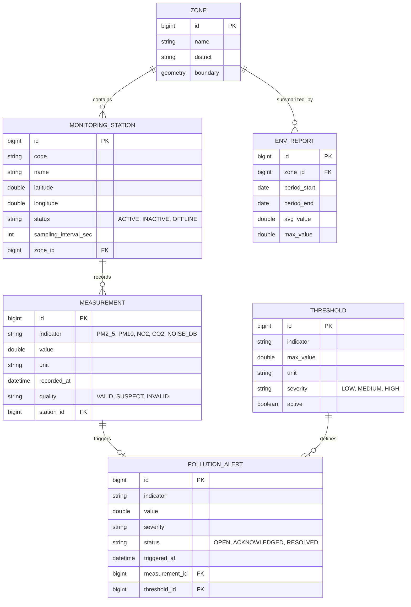

# MS4 — EcoCity Data Model

Aligned with the MS4 UML class diagram (`ms4-ecocity-class-diagram.png`).
Entities are not implemented yet in this validation step.

```mermaid
erDiagram
    ZONE ||--o{ MONITORING_STATION : contains
    ZONE ||--o{ ENV_REPORT : summarized_by
    MONITORING_STATION ||--o{ MEASUREMENT : records
    MEASUREMENT ||--o| POLLUTION_ALERT : triggers
    THRESHOLD ||--o{ POLLUTION_ALERT : defines

    ZONE {
        bigint id PK
        string name
        string district
        geometry boundary
    }
    MONITORING_STATION {
        bigint id PK
        string code
        string name
        double latitude
        double longitude
        string status "ACTIVE, INACTIVE, OFFLINE"
        int sampling_interval_sec
        bigint zone_id FK
    }
    MEASUREMENT {
        bigint id PK
        string indicator "PM2_5, PM10, NO2, CO2, NOISE_DB"
        double value
        string unit
        datetime recorded_at
        string quality "VALID, SUSPECT, INVALID"
        bigint station_id FK
    }
    THRESHOLD {
        bigint id PK
        string indicator
        double max_value
        string unit
        string severity "LOW, MEDIUM, HIGH"
        boolean active
    }
    POLLUTION_ALERT {
        bigint id PK
        string indicator
        double value
        string severity
        string status "OPEN, ACKNOWLEDGED, RESOLVED"
        datetime triggered_at
        bigint measurement_id FK
        bigint threshold_id FK
    }
    ENV_REPORT {
        bigint id PK
        bigint zone_id FK
        date period_start
        date period_end
        double avg_value
        double max_value
    }
```
